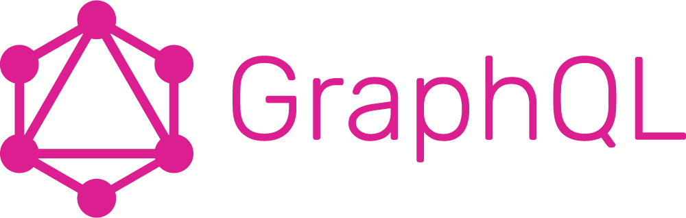

  

## 🛠️ **Core Skills**

- **Strong Fundamentals**: In-depth knowledge of GraphQL schema design, queries, mutations, and subscriptions.
- **Integration Expertise**: Proficient in integrating GraphQL with frontend frameworks like React.
- **Backend Mastery**: Skilled in implementing GraphQL APIs with Node.js and Apollo Server.

### **GraphQL Schema Design**
- Creating well-structured schemas with types, interfaces, and enums.
- Defining clear relationships between entities (e.g., one-to-many, many-to-many).
- Leveraging directives for schema customization.

### **Efficient Query and Mutation Design**
- Writing optimized queries and mutations to fetch or modify data.
- Managing nested queries to reduce over-fetching or under-fetching of data.
- Utilizing aliases, fragments, and variables for better query performance.

### **Subscription Implementation**
- Setting up real-time communication using subscriptions.
- Managing WebSocket connections and performance optimization.

### **GraphQL with Frontend**
- Integrating GraphQL APIs with **React** using Apollo Client.
- Managing client-side caching and state management efficiently.
- Handling errors and loading states gracefully.

### **GraphQL with Backend**
- Implementing GraphQL APIs using **Node.js** and **Apollo Server**.
- Designing resolvers to manage data retrieval and mutation.
- Integrating GraphQL APIs with databases like **PostgreSQL** and **MongoDB**.

### **Testing and Debugging**
- Writing unit and integration tests for GraphQL APIs using Jest and Apollo Testing Utilities.
- Debugging common issues such as N+1 queries and schema validation errors.

---

## 📚 Projects

| Repository                                                                 | Project Description                                                                                                                                                                  | Technologies Used                                                                                                                                                                                                                                             |
|----------------------------------------------------------------------------|--------------------------------------------------------------------------------------------------------------------------------------------------------------------------------------|---------------------------------------------------------------------------------------------------------------------------------------------------------------------------------------------------------------------------------------------------------------|
| [E-Commerce Platform (GraphQL)](https://github.com/skalvarony/e-commerce-graphql) | A full-stack e-commerce platform offering a seamless user experience with payment integration and dynamic product management.                                                        |     |
| [GraphQL Server](https://github.com/skalvarony/graphql-server)             | Demonstrates a simple GraphQL API built with Apollo Server. It provides functionalities for managing a list of persons, querying their details, and modifying data through mutations. |    |

 

  <a href="./README.md" style="text-decoration: none;">
    <button style="
      background-color: #808080;
      color: white;
      border: none;
      padding: 10px 20px;
      border-radius: 35px;
      cursor: pointer;
      font-size: 16px;
    ">
      🔙 Home
    </button>
  </a>

---

  
  

