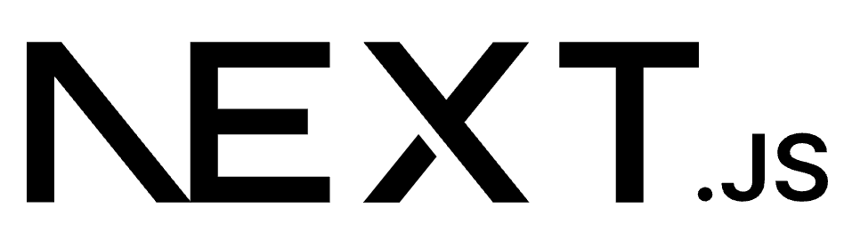

  

 

# Core Next.js Skills

- **Server-Side Rendering (SSR)**: Expertise in building SEO-friendly applications with SSR and optimizing server-side performance.
- **Static Site Generation (SSG)**: Skilled in generating highly efficient and scalable static websites using Next.js.
- **Dynamic Routing**: Mastery in creating dynamic, nested, and API routes to handle complex application structures.
- **API Routes**: Experience in building custom backend APIs directly within Next.js applications.
- **Middleware**: Knowledge of implementing and managing middleware for authentication, caching, and logging in Next.js projects.

# Complementary Skills

- **React Integration**: Deep understanding of integrating React features like Hooks, Context API, and state management libraries (e.g., Redux, Zustand) within Next.js.
- **Tailored SEO**: Proficient in implementing meta tags, canonical links, and Open Graph for optimized SEO strategies.
- **Styling**: Skilled in integrating styled-components, Tailwind CSS, and CSS Modules for responsive and dynamic designs.
- **Authentication**: Implementing secure authentication flows using libraries like NextAuth.js and Firebase Auth.
- **API and Data Fetching**: Expertise in using `getServerSideProps`, `getStaticProps`, and `getStaticPaths` for fetching data efficiently.

# 🛠️ Tools and Frameworks

- **NextAuth.js**: Secure authentication for Next.js applications.
- **Vercel**: Optimized deployment for Next.js projects.
- **React Query**: For data fetching and caching in Next.js.
- **GraphQL**: Integrating Next.js with GraphQL APIs for structured queries.
- **SWR**: Stale-while-revalidate data fetching for client-side performance.

---

## 📚 Projects

| Repository                                                                 | Project Description                                                                                                                                                                  | Technologies Used                                                                                                                                                                                                                                             |
|----------------------------------------------------------------------------|--------------------------------------------------------------------------------------------------------------------------------------------------------------------------------------|---------------------------------------------------------------------------------------------------------------------------------------------------------------------------------------------------------------------------------------------------------------|
|  [Next.js Dashboard](https://github.com/skalvarony/nextjs-dashboard)          | Comprehensive business platform featuring an intuitive dashboard for efficient invoice management and tracking.                                                                                 |     |

 

  <a href="./README.md" style="text-decoration: none;">
    <button style="
      background-color: #808080;
      color: white;
      border: none;
      padding: 10px 20px;
      border-radius: 35px;
      cursor: pointer;
      font-size: 16px;
    ">
      Home
    </button>
  </a>

---

  
  

