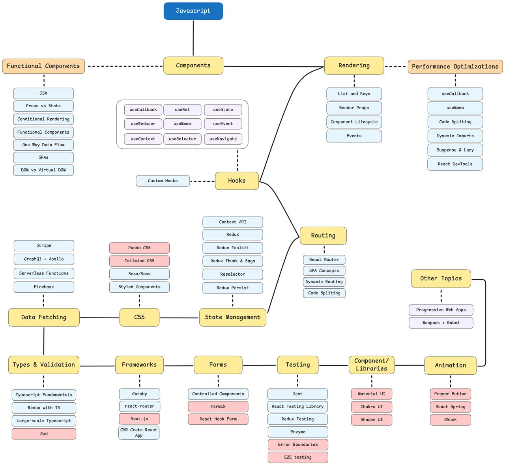

  

 

### **🛠️ Core Skills**
- **React.js**: Building interactive and modular UIs.
- **Redux & Redux Toolkit**: State management for large-scale applications.
- **Hooks**: Advanced React hooks like `useState`, `useEffect`, `useCallback`, and `useContext`.
- **React Router**: Dynamic routing for SPAs.

### **⚡ UI/Styling**
- **Tailwind CSS**: Utility-first styling for rapid UI development.
- **Styled Components**: CSS-in-JS approach for styling React components.
- **CSS/SASS**: Modern styling techniques.

### **🌟 Performance Optimization**
- **React.memo** and **useMemo**: Prevent unnecessary re-renders.
- **Code Splitting**: Optimize bundle sizes using dynamic imports.
- **Suspense & Lazy**: Load components asynchronously for better performance.

  
<strong>📊 My Full React Roadmap</strong>

  

    
  

---

## 📚 Projects

| Repository                                                                 | Project Description                                                                                                                                                                  | Technologies Used                                                                                                                                                                                                                                             |
|----------------------------------------------------------------------------|--------------------------------------------------------------------------------------------------------------------------------------------------------------------------------------|---------------------------------------------------------------------------------------------------------------------------------------------------------------------------------------------------------------------------------------------------------------|
| [Planifyz](https://github.com/UFV-INGINF/proyecto-fin-de-grado-2024-2-skalvarony)                      | An educational platform empowering primary school students to self-manage and plan their studies. Features include interactive calendars, progress tracking for parents, and personalized study recommendations.            |      |
| [E-Commerce Platform](https://github.com/skalvarony/e-commerce) | A full-stack e-commerce platform offering a seamless user experience with payment integration and dynamic product management.                                                        |     |
| [E-Commerce Platform (GraphQL)](https://github.com/skalvarony/e-commerce-graphql) | A full-stack e-commerce platform offering a seamless user experience with payment integration and dynamic product management.                                                        |     |
| [Next.js Dashboard](https://github.com/skalvarony/nextjs-dashboard)          | Comprehensive business platform featuring an intuitive dashboard for efficient invoice management and tracking.                                                                                 |     |
| [Films Search Box](https://github.com/skalvarony/films-search-box)         | Feature-rich application that retrieves movies via an API call and includes a built-in search bar for seamless discovery.                                                             |    |
| [Gatsby Blog](https://github.com/skalvarony/gatsby-blog)                   | Blog built with Gatsby that allows you to create new posts and access in-depth details for each entry.                                                                               |   |

 

  <a href="./README.md" style="text-decoration: none;">
    <button style="
      background-color: #808080;
      color: white;
      border: none;
      padding: 10px 20px;
      border-radius: 35px;
      cursor: pointer;
      font-size: 16px;
    ">
      🔙 Home
    </button>
  </a>

---

  
  

